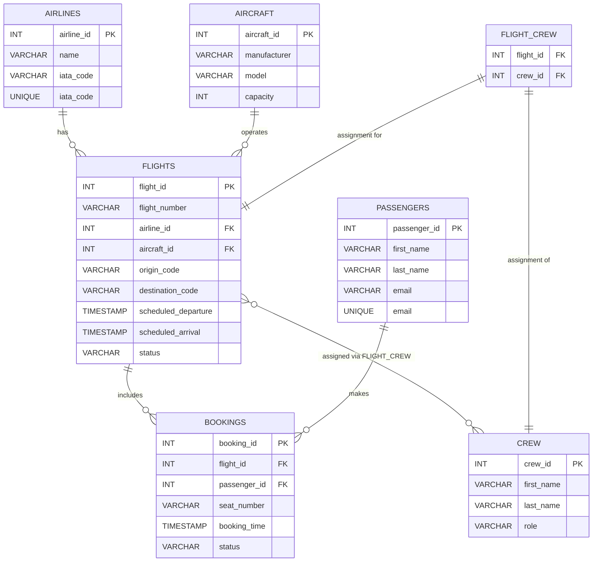

# Airport Management System - Entity-Relationship Diagram (Simplified)

This document contains the Entity-Relationship Diagram (ERD) for the simplified Airport Management System database, represented using Mermaid syntax.

## ERD

## Explanation

*   **Entities:** The core entities are `AIRLINES`, `AIRCRAFT`, `FLIGHTS`, `PASSENGERS`, `BOOKINGS`, `CREW`, and the junction table `FLIGHT_CREW`.
*   **Attributes:** Each entity has essential attributes defined with basic types (`INT`, `VARCHAR`, `TIMESTAMP`). Primary Keys (PK) and Foreign Keys (FK) are indicated.
*   **Relationships:**
    *   One-to-Many (1:M): An `AIRLINE` has multiple `FLIGHTS`; an `AIRCRAFT` operates multiple `FLIGHTS`; a `FLIGHT` includes multiple `BOOKINGS`; a `PASSENGER` can make multiple `BOOKINGS`.
    *   Many-to-Many (M:M): A `FLIGHT` can have multiple `CREW` members assigned, and a `CREW` member can be assigned to multiple `FLIGHTS`. This is modeled using the `FLIGHT_CREW` junction table.
*   **Simplifications:** This model focuses on the core aspects needed for the planned PL/PGSQL functionality. Details like addresses, specific aircraft configurations, detailed crew scheduling rules, etc., are omitted for simplicity. 